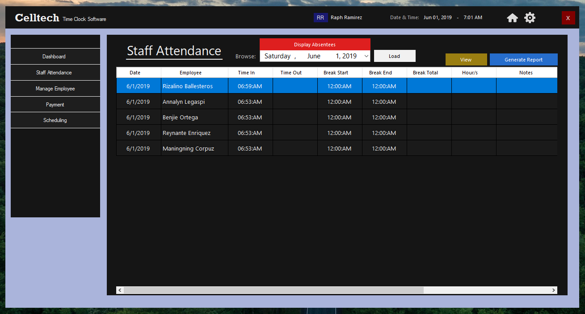
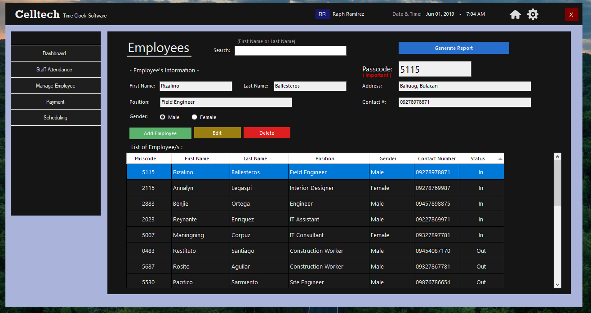
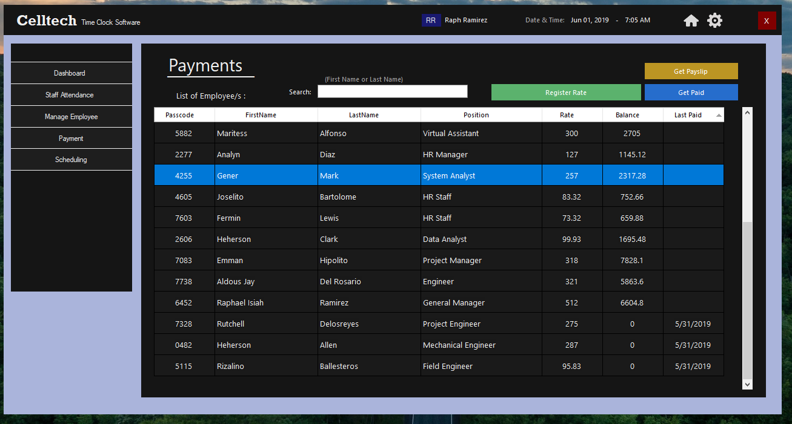

# Celltech - Time Clock Software

Celltech is a time clock windows system developed using VisualBasic and MS Access as database.
This is a school project in Bulacan State University, and the main goal of the project is to automate the attendance checking of a site engineer.

## Setup

You can try the application by going to the _Installer_ directory and run _setup.exe_

## Screenshots

### Passcode
each employee has their own unique passcode

### Clock In

### Admin Login
Admin Login UI will be visible after entering a 0143 passcode.

### Dashboard

### Staff Attendance

### Employee Masterlist

### Payments

### Scheduling

